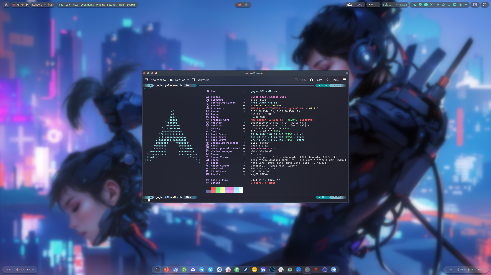
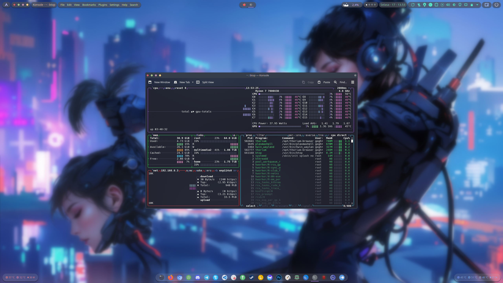
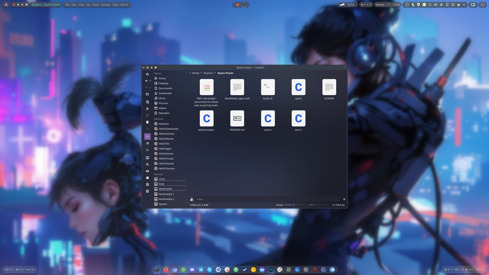
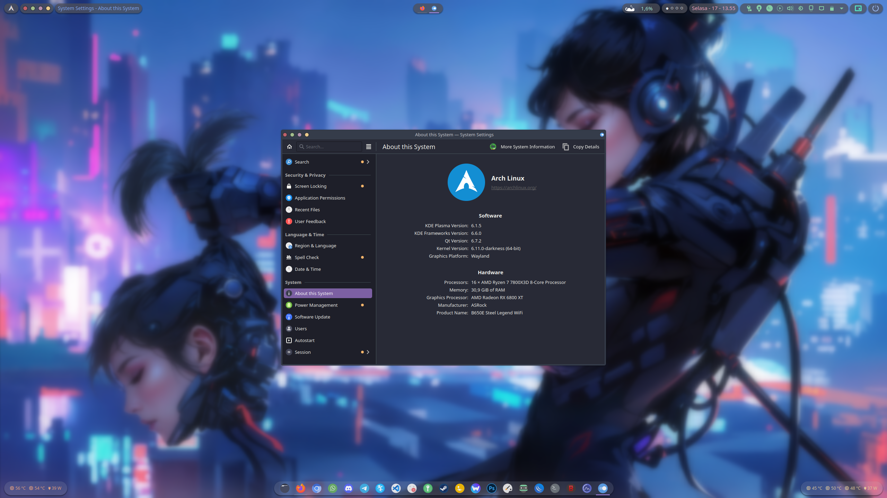

# Various configurations & settings for my Personal Workstation PC

Things included:
- Bash
- Starship
- LSD
- BTOP
- MangoHud
- MPV
- OpenRGB
- FastFetch
- KDE's Yakuake
- KDE's Konsole
- KDE's Dolphin
- KDE's Panel Colorizer
- Kvantum
- etc

